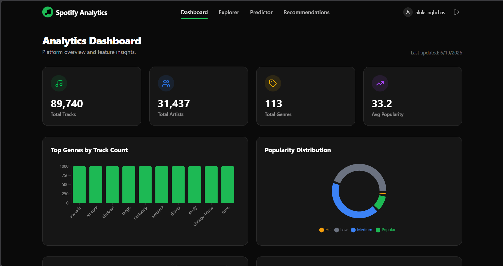
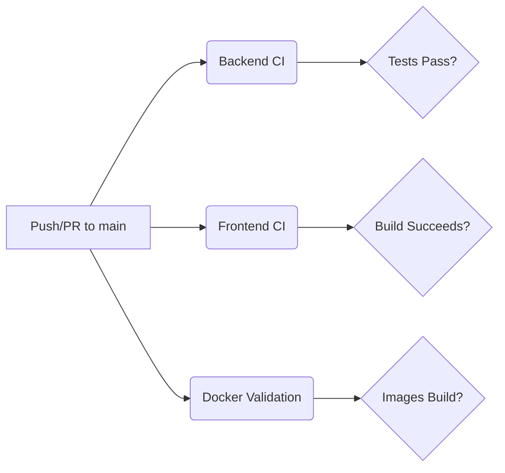

# Spotify Analytics Platform

  

### 🎥 Quick Video Tour
https://github.com/SINGHALOK28/spotify-analytics-platform/raw/main/docs/dashboard-screenrecording.mp4

> **Live URLs:**
> - **Frontend (Vercel):** [https://spotify-analytics-platform.vercel.app](https://spotify-analytics-platform.vercel.app)
> - **Backend API (Render):** [https://spotify-analytics-platform.onrender.com/docs](https://spotify-analytics-platform.onrender.com/docs)
> 
> *Note: The backend is hosted on Render's free tier. The first load may take 30-60 seconds if the server has been idle. Subsequent requests are fast.*

## Overview
This platform uncovers deep insights, predicts hit songs using Machine Learning, and explores track similarity.

## Tech Stack
- **Frontend:** React, Vite, Tailwind CSS, Framer Motion
- **Backend:** FastAPI, Python, SQLAlchemy, Scikit-Learn
- **Database:** PostgreSQL (Neon)
- **Data Pipeline:** Apache Airflow
- **Deployment:** Vercel (Frontend), Render (Backend API), Docker Compose (Local)

## Observability & CI/CD Architecture

### CI/CD Pipeline (GitHub Actions)
The project uses GitHub Actions to automate testing and building. The pipeline triggers on pushes and pull requests to `main`.

### Logging Architecture
- **Centralized Logging:** All application events (auth, predictions, recommendations) and API requests are logged via standard Python logging.
- **Middleware:** A FastAPI `RequestLoggerMiddleware` logs incoming requests, methods, statuses, and response times.
- **Outputs:** Logs are streamed to the console and to `logs/app.log`.

### Monitoring Architecture
- **System Metrics:** A `system_metrics` table tracks daily aggregate counts of API requests, predictions, recommendations, and login events.
- **ETL Monitoring:** Airflow ETL runs are tracked in an `etl_logs` table, storing run durations, rows processed, and success/failure status.
- **Admin Dashboard:** A dedicated `/admin/monitoring` frontend page visualizes these metrics in real-time.

## Screenshots
### Dashboard

### Monitoring Dashboard
*(Placeholder for Monitoring Dashboard Screenshot)*

## Deployment Documentation
Please see [docs/DEPLOYMENT.md](./docs/DEPLOYMENT.md) for full architecture details, environment variables, and deployment instructions.
